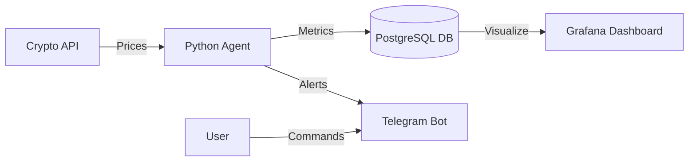

# 📡 CryptoStation Telemetry (CSTM)


**CryptoStation Telemetry** is a comprehensive hardware and market monitoring system designed for high-performance engineering workstations. It orchestrates real-time hardware telemetry (GPU/CPU/RAM) alongside financial market data, providing a unified dashboard for system health and asset tracking.

> **Key Feature:** The system supports a **"Hybrid Architecture"** to bypass VM isolation on Windows/MacOS, ensuring 100% accurate hardware metrics during development.

---

## 🏗 System Architecture

The project implements a **Producer-Consumer** pattern with time-series persistence.



### Core Components

- **Agent (app.main)**: Multi-threaded orchestrator.
  - **Thread A**: Polls hardware/market data every 60s.
  - **Thread B**: Handles Telegram interactions asynchronously.
- **Persistence**: PostgreSQL containerized instance (Docker).
- **Visualization**: Grafana connected to DB for historical thermal analysis.
- **Interface**: Interactive Telegram Bot (`/status`, `/graph`).

---

## 🚀 Features

- **Real-time Telemetry**: Accurate CPU Load, RAM Usage, and GPU Temperature monitoring via native OS calls.
- **Interactive Bot**:
  - `/status` - Instant system health check.
  - `/graph` - Generates and sends a 24-hour thermal plot image directly to chat.
- **Market Watch**: Tracks BTC/ETH prices with API rate-limit protection.
- **Grafana Dashboard**: Professional visualization of historical data.

---

## 🛠 Deployment & Setup

This project supports two deployment modes depending on the host OS environment.

### Mode A: Production (Linux Servers)

Fully containerized deployment. The agent runs inside Docker with host PID access.

```bash
docker-compose up -d --build
```

### Mode B: Hybrid Development (Windows/MacOS)

Recommended for Windows to ensure accurate hardware readings by bypassing the Docker VM layer.

In this mode, the Database and Grafana run in Docker containers, while the Python Agent runs natively on the Host OS to access hardware counters.

#### 1. Start Infrastructure (DB + Grafana)

```bash
docker-compose up -d db grafana
```

#### 2. Setup Local Python Environment

```bash
# Create virtual environment
python -m venv .venv

# Activate (Windows Powershell)
.venv\Scripts\activate

# Install dependencies
pip install -r requirements.txt
```

#### 3. Configure Environment

Create a `.env` file in the root directory:

```ini
TELEGRAM_TOKEN=your_telegram_bot_token
CHAT_ID=your_telegram_chat_id

# Database Configuration (Connects to Docker via localhost)
POSTGRES_HOST=localhost
POSTGRES_USER=postgres
POSTGRES_PASSWORD=password
POSTGRES_DB=cstm_db
```

#### 4. Run the Agent

```bash
python -m app.main
```

---

## 📊 Visuals & Access

- **Grafana Dashboard**: Access at http://localhost:3000
  - Login: `admin` / `admin`
  - Data Source: Connect to PostgreSQL (Host: `db`, User: `postgres`, Pass: `password`)
- **Telegram Bot**: Search for your bot and type `/start`.

---

## 🔧 Tech Stack

- **Core**: Python 3.10, Multithreading, Psycopg2.
- **Data Analysis**: Pandas, Matplotlib (for generating chart images).
- **Infrastructure**: Docker Compose, PostgreSQL 15.
- **APIs**: CoinGecko, Telegram Bot API.
